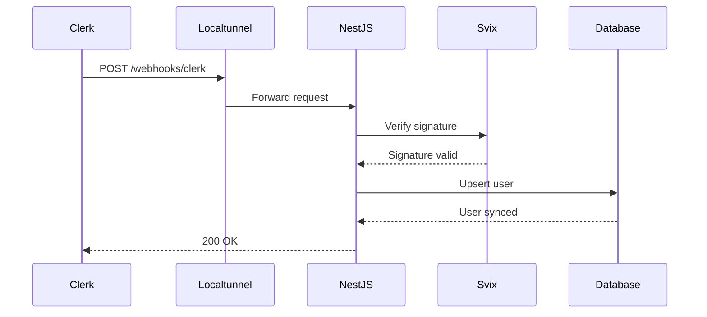

# Clerk Webhook Setup & Testing Guide

## Overview
This guide explains how to set up and test Clerk webhooks using localtunnel for local development.

## Prerequisites
- Clerk account with a configured application
- NestJS backend running locally
- `svix` package installed (already done)

---

## Step 1: Add Webhook Secret to Environment

Add the following to your `.env` file:

```env
CLERK_WEBHOOK_SECRET=whsec_your_webhook_secret_here
```

> **Note**: You'll get this secret from Clerk Dashboard after creating the webhook endpoint (Step 3).

---

## Step 2: Install and Start Localtunnel

### Install Localtunnel Globally

```bash
npm install -g localtunnel
```

### Start Your NestJS Server

```bash
npm run start:dev
```

The server should be running on `http://localhost:3000` (or your configured port).

### Create a Localtunnel

Open a new terminal and run:

```bash
lt --port 3000 --subdomain your-unique-name
```

> **Important**: Replace `your-unique-name` with a unique subdomain (e.g., `krish-blog-webhooks`)

You'll get a URL like: `https://your-unique-name.loca.lt`

---

## Step 3: Configure Webhook in Clerk Dashboard

### Navigate to Clerk Dashboard

1. Go to [Clerk Dashboard](https://dashboard.clerk.com/)
2. Select your application
3. Navigate to **Webhooks** in the sidebar
4. Click **+ Add Endpoint**

### Configure Endpoint

**Endpoint URL:**
```
https://your-unique-name.loca.lt/webhooks/clerk
```

**Events to Subscribe:**
- ✅ `user.created`
- ✅ `user.updated`
- ✅ `user.deleted`

### Copy Signing Secret

After creating the endpoint:
1. Click on the endpoint you just created
2. Find **Signing Secret** section
3. Click **Show** and copy the secret (starts with `whsec_`)
4. Add it to your `.env` file as `CLERK_WEBHOOK_SECRET`

### Restart Your Server

After adding the secret, restart your NestJS server:

```bash
# Stop the server (Ctrl+C) and restart
npm run start:dev
```

---

## Step 4: Test the Webhook

### Method 1: Create a Test User in Clerk

1. Go to Clerk Dashboard → **Users**
2. Click **+ Create User**
3. Fill in user details and create

**Expected Behavior:**
- Webhook will be triggered
- Check your NestJS console logs for:
  ```
  Processing Clerk webhook event: user.created
  Successfully synced Clerk user: user_xxx → DB user: uuid
  ```

### Method 2: Use Clerk's Testing Feature

1. In Clerk Dashboard → **Webhooks** → Your Endpoint
2. Click **Testing** tab
3. Select `user.created` event
4. Click **Send Example**

**Expected Response:**
```json
{
  "success": true
}
```

---

## Step 5: Verify Database Sync

### Check Your Database

After triggering the webhook, verify that:

1. **User Table** has a new record with:
   - `clerkId`: Clerk user ID
   - `email`: User's email
   - `name`: User's full name
   - `avatar`: Profile picture URL
   - `emailVerified`: `true`

2. **UserSecurity Table** has a corresponding record with:
   - `userId`: Linked to User table
   - `password`: Empty string
   - `emailVerified`: `true`

### SQL Query to Verify

```sql
SELECT 
  u.id, 
  u.clerkId, 
  u.email, 
  u.name,
  us.emailVerified,
  us.password
FROM "User" u
LEFT JOIN "UserSecurity" us ON u.id = us.userId
WHERE u.clerkId IS NOT NULL;
```

---

## Troubleshooting

### Issue: "Invalid webhook signature"

**Cause:** Webhook secret mismatch

**Solution:**
1. Verify `CLERK_WEBHOOK_SECRET` in `.env` matches Clerk Dashboard
2. Restart NestJS server after updating `.env`
3. Ensure no extra spaces in the secret

### Issue: "Webhook secret not configured"

**Cause:** `CLERK_WEBHOOK_SECRET` not set

**Solution:**
1. Add `CLERK_WEBHOOK_SECRET=whsec_...` to `.env`
2. Restart server

### Issue: Localtunnel shows "Tunnel Closed"

**Cause:** Localtunnel connection dropped

**Solution:**
```bash
# Restart localtunnel
lt --port 3000 --subdomain your-unique-name
```

### Issue: 404 Not Found

**Cause:** Incorrect webhook URL

**Solution:**
- Verify URL is: `https://your-subdomain.loca.lt/webhooks/clerk`
- Ensure NestJS server is running
- Check that `ClerkWebhookModule` is imported in `app.module.ts`

---

## Testing Scenarios

### Scenario 1: New Clerk User (No Existing Email)

**Action:** Create a new user in Clerk with email `newuser@example.com`

**Expected Result:**
- New `User` record created with `clerkId`
- New `UserSecurity` record with empty password
- `emailVerified` = `true`

### Scenario 2: Account Linking (Existing Email)

**Action:** 
1. Manually sign up a user with email `existing@example.com`
2. Create a Clerk user with the same email

**Expected Result:**
- Existing `User` record updated with `clerkId`
- `UserSecurity.emailVerified` updated to `true`
- No duplicate users created

### Scenario 3: User Update

**Action:** Update user profile in Clerk (name, avatar, etc.)

**Expected Result:**
- `User` record updated with new information
- Console log: `Successfully updated user: uuid from Clerk`

### Scenario 4: User Deletion (Soft Delete)

**Action:** Delete a Clerk user from Clerk Dashboard

**Expected Result:**
- `User.isActive` set to `false` (soft delete)
- `User.clerkId` set to `null` (unlinked from Clerk)
- All `RefreshToken` records for that user have `isRevoked` set to `true`
- User data (posts, comments, etc.) preserved in database
- Console logs:
  ```
  Successfully soft-deleted user: uuid (clerkId: user_xxx)
  Revoked all refresh tokens for user: uuid
  ```

**Verification Query:**
```sql
SELECT id, email, isActive, clerkId 
FROM "User" 
WHERE email = 'deleted-user@example.com';
```

**Note:** Soft delete is used instead of hard delete to:
- Preserve data integrity (posts, comments remain)
- Maintain audit trail for compliance
- Allow account recovery if user signs up again

---

## Production Deployment

For production, replace localtunnel with your actual domain:

**Webhook URL:**
```
https://api.yourdomain.com/webhooks/clerk
```

**Important:**
- Ensure HTTPS is enabled
- Set `CLERK_WEBHOOK_SECRET` in production environment
- Monitor webhook logs for failures
- Consider implementing retry logic for failed webhooks

---

## Architecture Overview



---

## Webhook Event Flow

### user.created Event
1. Clerk sends webhook with user data
2. Svix verifies signature
3. Extract primary email and user details
4. **Upsert** user in database:
   - If email exists → Link `clerkId` (account linking)
   - If new → Create user + UserSecurity
5. Set `emailVerified` = `true`
6. Return success response

### user.updated Event
1. Clerk sends webhook with updated data
2. Svix verifies signature
3. Find user by `clerkId`
4. Update user profile (name, email, avatar)
5. Return success response

### user.deleted Event
1. Clerk sends webhook when user is deleted
2. Svix verifies signature
3. Find user by `clerkId`
4. **Soft delete**: Set `isActive = false` and `clerkId = null`
5. Revoke all refresh tokens (invalidate sessions)
6. Return success response

> **Note**: Soft delete is used to preserve data integrity, audit trails, and allow account recovery.

---

## Code Structure

```
src/webhooks/clerk/
├── clerk.module.ts          # Module configuration
├── clerk.controller.ts      # POST /webhooks/clerk endpoint
└── clerk.service.ts         # Business logic & Svix verification
```

### Key Features

✅ **Svix Signature Verification** - Ensures requests are from Clerk  
✅ **Account Linking** - Links Clerk users with existing manual signups  
✅ **Hybrid Auth Support** - Works with both Clerk and manual auth  
✅ **Transaction Safety** - User + UserSecurity created atomically  
✅ **Soft Delete** - Preserves data integrity when users are deleted  
✅ **Session Revocation** - Invalidates all tokens on user deletion  
✅ **Comprehensive Logging** - Detailed logs for debugging  
✅ **Bilingual Comments** - English + Gujarati documentation

---

## Next Steps

- [ ] Test all four scenarios above
- [ ] Monitor webhook delivery in Clerk Dashboard
- [ ] Set up webhook monitoring/alerting for production
- [ ] Document any edge cases discovered during testing
