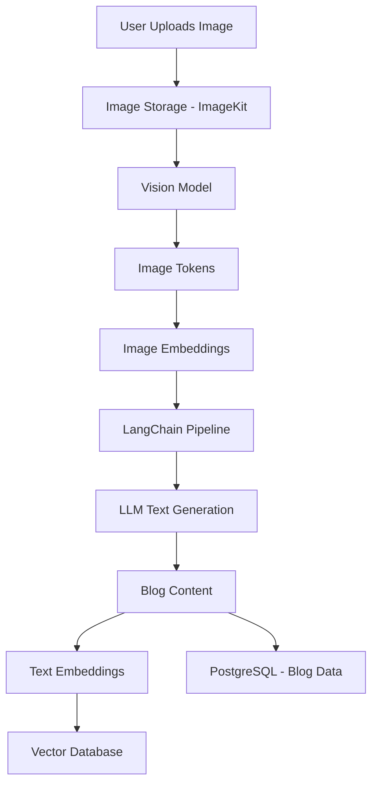
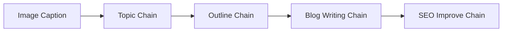
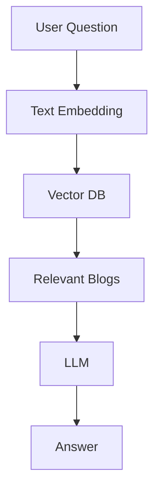

# AI Blog Platform – Image Based Content Generation with LangChain

> **Goal**: Explain how image-based content generation works end‑to‑end using **tokenization, embeddings, vectors**, and **LangChain**, with a **FREE-first approach**.

---

## 1. High-Level Overview

An **AI Blog Platform (Image → Blog)** converts an uploaded image into meaningful text content (blog) using pretrained AI models and an orchestration framework (LangChain).

**Core idea**:
```
Image → Understanding → Meaning (Vectors) → Reasoning → Text Generation
```

---

## 2. System Architecture (Bird’s Eye View)



---

## 3. Image-Based Content Generation (Concept)

### What happens when a user uploads an image?

1. Image is uploaded and stored (ImageKit)
2. Public image URL is generated
3. Vision model analyzes the image
4. Image is converted into **numerical representations**
5. AI generates text based on meaning

> ⚠️ Important: **You do NOT train a model**. You use a **pretrained vision + language model** (inference only).

---

## 4. Image Tokenization (How AI Reads Images)

### What is tokenization?

**Tokenization** = breaking input into smaller units the model can understand.

### Text Tokenization
```
"AI changes web development"
→ [AI] [changes] [web] [development]
```

### Image Tokenization

Images are **not words**. They are processed as:

```
Image
→ Resize & Normalize
→ Split into patches (small pixel blocks)
→ Convert patches into numbers
```

These numeric patches act like **image tokens**.

---

## 5. Embeddings (Meaning Representation)

### What is an Embedding?

An **embedding** is a vector (array of numbers) that represents **semantic meaning**.

```ts
[0.12, -0.44, 1.08, ...]
```

### Types of Embeddings

| Type | Purpose |
|----|-------|
| Image Embeddings | Understand image meaning |
| Text Embeddings | Search, similarity, memory |

> Modern AI models map **image and text embeddings into the same vector space**, allowing cross‑modal understanding.

---

## 6. Vectors & Vector Databases

### Why Vectors?

Vectors allow AI to:
- Compare meaning
- Find similarity
- Store long-term memory

### Vector Database Role

A vector DB stores embeddings and supports **semantic search**.

**Free options**:
- Qdrant
- Supabase Vector
- Weaviate (community)

---

## 7. Where LangChain Fits

LangChain is **NOT a model**.

> LangChain = **AI workflow orchestration framework**

It connects:
- Prompts
- Models
- Chains (steps)
- Memory
- Vector databases

---

## 8. Image → Blog using LangChain (Correct Way)

LangChain **does not process images directly**.

So the flow is split:

```
Image → Caption (Vision Model)
Caption → LangChain Text Pipeline
```

---

## 9. LangChain Multi-Step Pipeline



### Chain Responsibilities

1. **Topic Chain** – Generates blog title
2. **Outline Chain** – Creates blog structure
3. **Writing Chain** – Writes full blog
4. **SEO Chain** – Improves headings & keywords

---

## 10. LangChain Example (Conceptual)

```ts
Prompt: "Generate a blog outline from this image description"
↓
Prompt: "Write a beginner-friendly Medium blog using this outline"
```

Each step is reusable and independent.

---

## 11. Embeddings with LangChain

LangChain converts final blog text into embeddings:

```
Blog Content → Embedding Model → Vector
```

These vectors are stored for:
- Similar blogs
- Recommendations
- RAG (chat with blogs)

---

## 12. RAG (Retrieval Augmented Generation)



---

## 13. Free vs Paid Stack

### Free-First Stack (Recommended)

| Layer | Tool |
|----|----|
| LangChain | Open-source |
| LLM | Groq (LLaMA‑3) |
| Embeddings | HuggingFace |
| Vector DB | Qdrant |
| Image Storage | ImageKit |

### Paid Upgrade (Optional)

| Purpose | Tool |
|----|----|
| Vision | GPT‑4o |
| Embeddings | OpenAI |

---

## 14. What You Are NOT Doing

❌ Training models
❌ Managing GPUs
❌ Handling low-level ML math

✅ Using pretrained models
✅ Orchestrating intelligence with LangChain

---

## 15. Summary (Short & Clear)

- Images are converted into **tokens → embeddings → vectors**
- Vision models extract meaning from images
- LangChain orchestrates multi-step text generation
- Embeddings are stored in vector DB for memory & search
- The system is scalable, explainable, and production-ready

---

## 16. Interview-Ready One-Liner

> “We use a vision model to extract semantic meaning from images, convert that into embeddings, and pass it through a LangChain multi-step pipeline for blog generation. Final content embeddings are stored in a vector database to support semantic search and RAG.”

---

**End of Document**

