# Clerk Webhook Workflow - Complete Guide

## Table of Contents
1. [Overview](#overview)
2. [Architecture Diagram](#architecture-diagram)
3. [Webhook Flow](#webhook-flow)
4. [Event Types](#event-types)
5. [Security Flow](#security-flow)
6. [Data Synchronization](#data-synchronization)
7. [Error Handling](#error-handling)

---

## Overview

Clerk webhooks enable real-time synchronization between Clerk's authentication service and your local database. When user events occur on Clerk (create, update, delete), Clerk sends HTTP POST requests to your webhook endpoint.

**Key Benefits:**
- ✅ Automatic user synchronization
- ✅ Real-time updates
- ✅ Secure signature verification
- ✅ Hybrid authentication support

---

## Architecture Diagram

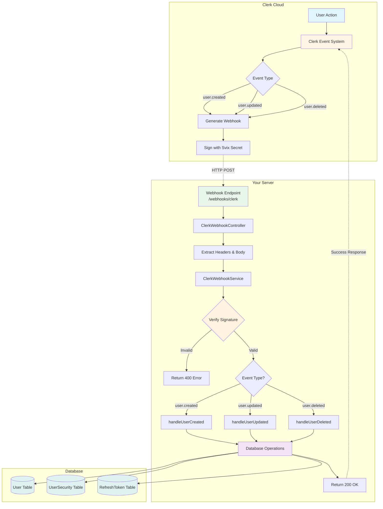

---

## Webhook Flow

### Complete Request-Response Flow

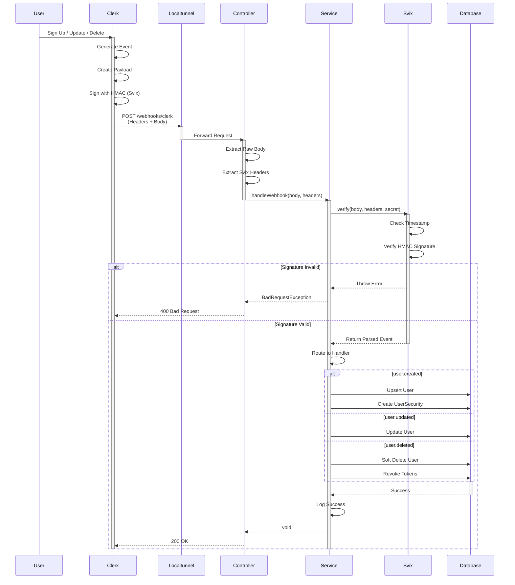

---

## Event Types

### 1. user.created Event

**Triggered When:**
- New user signs up via Clerk
- Admin creates user in Clerk Dashboard
- User signs in with OAuth for first time

**Flow Diagram:**

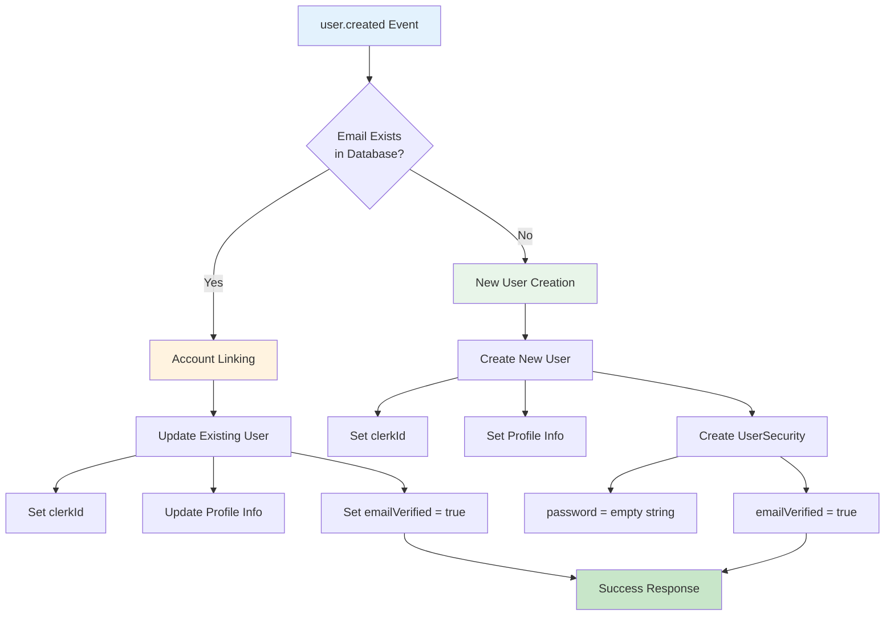

**Data Mapping:**

| Clerk Field | Database Field | Transformation |
|------------|----------------|----------------|
| `id` | `clerkId` | Direct mapping |
| `email_addresses[0].email_address` | `email` | Extract primary email |
| `first_name + last_name` | `name` | Concatenate, fallback to username |
| `username` | `username` | Fallback to email prefix |
| `image_url` | `avatar` | Direct mapping |
| N/A | `emailVerified` | Set to `true` |
| N/A | `password` | Empty string for Clerk users |

### 2. user.updated Event

**Triggered When:**
- User updates profile in Clerk
- User changes email/name/avatar
- Admin updates user in Clerk Dashboard

**Flow Diagram:**

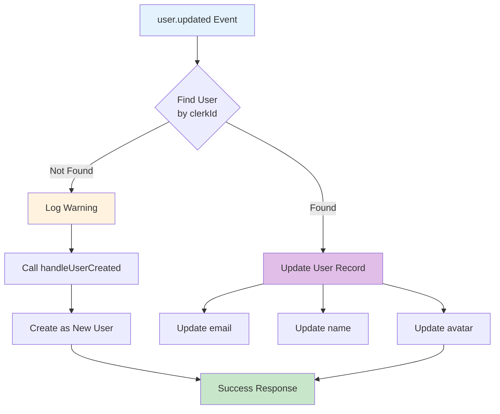

### 3. user.deleted Event

**Triggered When:**
- User deletes account in Clerk
- Admin deletes user in Clerk Dashboard
- User account is banned/suspended

**Flow Diagram:**

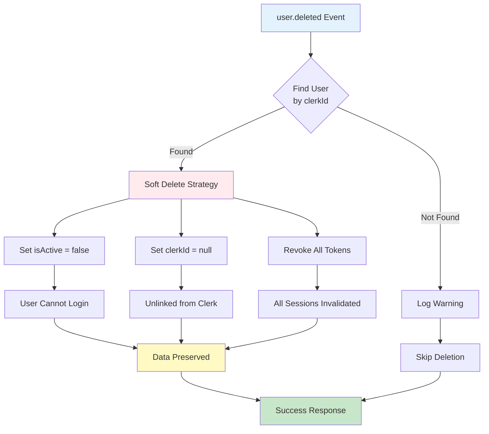

**Why Soft Delete?**

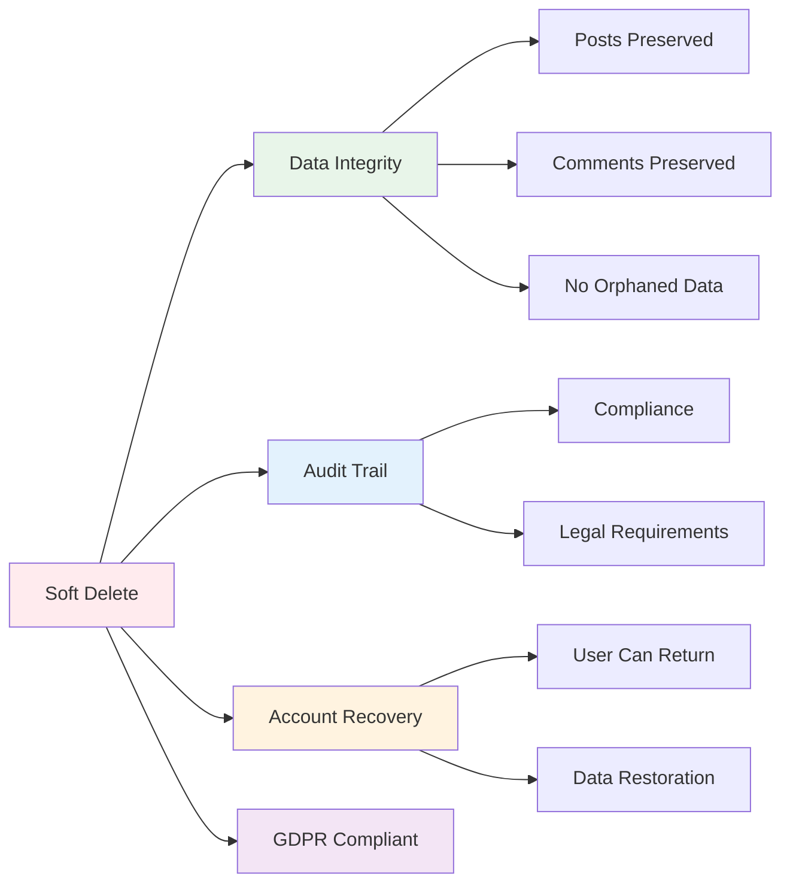

---

## Security Flow

### Svix Signature Verification

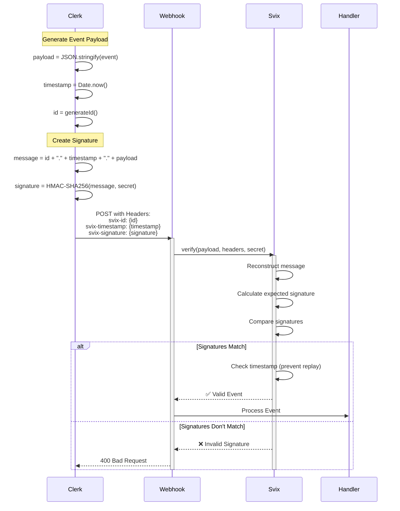

**Security Checks:**

1. **HMAC Signature Verification**
   - Ensures request came from Clerk
   - Prevents tampering with payload
   - Uses shared secret (CLERK_WEBHOOK_SECRET)

2. **Timestamp Validation**
   - Prevents replay attacks
   - Rejects old requests
   - Configurable tolerance window

3. **Request Origin**
   - Only accepts requests from Clerk IPs (optional)
   - Can add IP whitelist for extra security

---

## Data Synchronization

### Account Linking Flow

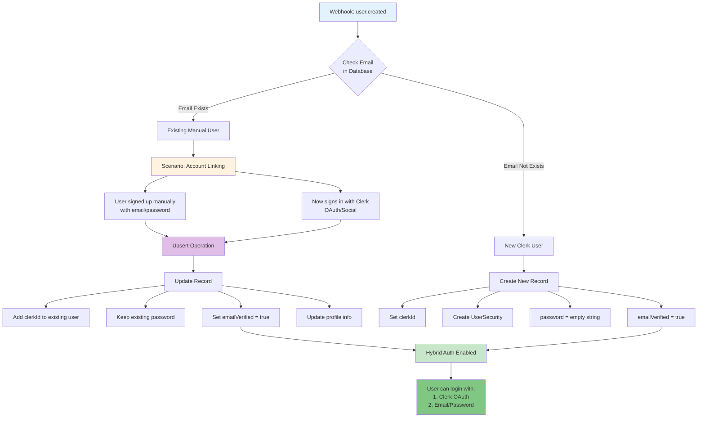

### Database Transaction Flow

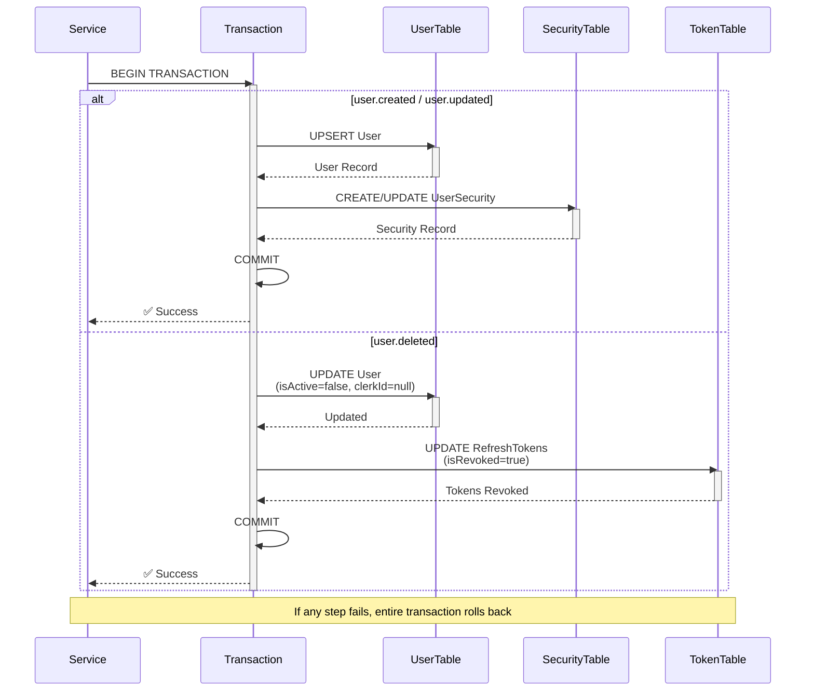

---

## Error Handling

### Error Flow Diagram

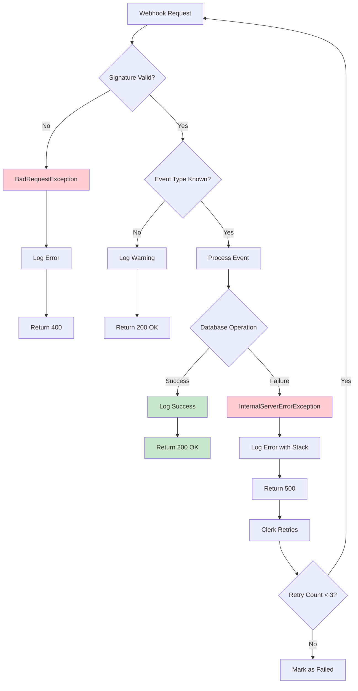

### Retry Mechanism

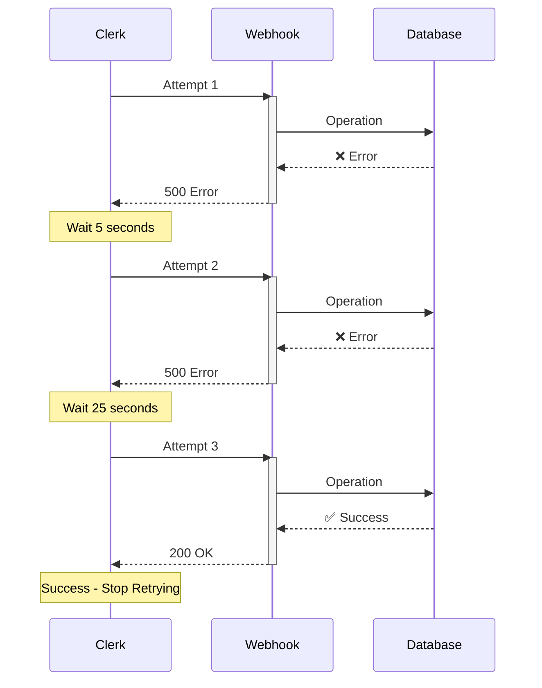

**Clerk Retry Strategy:**
- Attempt 1: Immediate
- Attempt 2: After 5 seconds
- Attempt 3: After 25 seconds
- Attempt 4: After 125 seconds (2 minutes)
- After 4 failures: Marked as failed in Clerk Dashboard

---

## Complete System Flow

### End-to-End Process

```mermaid
graph TB
    subgraph "1. User Action"
        A1[User Signs Up on Clerk]
        A2[User Updates Profile]
        A3[User Deletes Account]
    end
    
    subgraph "2. Clerk Processing"
        B1[Event Generated]
        B2[Payload Created]
        B3[HMAC Signature]
        B4[Add Headers]
    end
    
    subgraph "3. Network Layer"
        C1[Localtunnel/Public URL]
        C2[Forward to NestJS]
    end
    
    subgraph "4. NestJS Controller"
        D1[Receive POST Request]
        D2[Extract Raw Body]
        D3[Extract Svix Headers]
        D4[@Public Decorator<br/>Bypass JWT]
    end
    
    subgraph "5. Service Layer"
        E1[Verify Signature]
        E2[Parse Event]
        E3[Route to Handler]
    end
    
    subgraph "6. Event Handlers"
        F1[handleUserCreated]
        F2[handleUserUpdated]
        F3[handleUserDeleted]
    end
    
    subgraph "7. Database Operations"
        G1[Upsert User]
        G2[Create/Update Security]
        G3[Soft Delete]
        G4[Revoke Tokens]
    end
    
    subgraph "8. Response"
        H1[Log Success]
        H2[Return 200 OK]
        H3[Clerk Marks Delivered]
    end
    
    A1 --> B1
    A2 --> B1
    A3 --> B1
    
    B1 --> B2 --> B3 --> B4
    
    B4 --> C1 --> C2
    
    C2 --> D1 --> D2 --> D3 --> D4
    
    D4 --> E1 --> E2 --> E3
    
    E3 --> F1
    E3 --> F2
    E3 --> F3
    
    F1 --> G1 --> G2
    F2 --> G1
    F3 --> G3 --> G4
    
    G2 --> H1
    G4 --> H1
    
    H1 --> H2 --> H3
    
    style A1 fill:#e3f2fd
    style A2 fill:#e3f2fd
    style A3 fill:#e3f2fd
    style E1 fill:#fff3e0
    style G1 fill:#e8f5e9
    style H3 fill:#c8e6c9
```

---

## Implementation Summary

### File Structure

```
src/webhooks/clerk/
├── clerk.module.ts          # Module configuration
├── clerk.controller.ts      # POST /webhooks/clerk endpoint
└── clerk.service.ts         # Business logic & handlers
```

### Key Technologies

- **Svix**: Webhook signature verification
- **NestJS**: Framework for webhook endpoint
- **Prisma**: Database ORM for user sync
- **Localtunnel**: Local development tunnel

### Configuration Required

```env
CLERK_WEBHOOK_SECRET=whsec_your_secret_here
```

### Clerk Dashboard Setup

1. Navigate to Webhooks
2. Add endpoint: `https://your-domain.com/webhooks/clerk`
3. Subscribe to events: `user.created`, `user.updated`, `user.deleted`
4. Copy signing secret to `.env`

---

## Testing Workflow

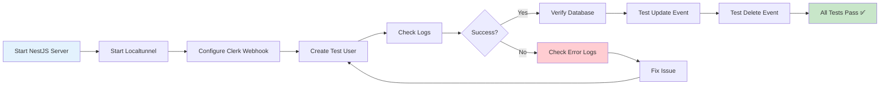

---

## Conclusion

This webhook system provides:
- ✅ **Real-time synchronization** between Clerk and your database
- ✅ **Secure verification** using Svix HMAC signatures
- ✅ **Hybrid authentication** supporting both Clerk and manual signup
- ✅ **Account linking** for seamless user experience
- ✅ **Soft delete** preserving data integrity
- ✅ **Comprehensive error handling** with automatic retries
- ✅ **Production-ready** with logging and monitoring

The implementation ensures your local database stays perfectly in sync with Clerk while maintaining security, data integrity, and compliance requirements.
