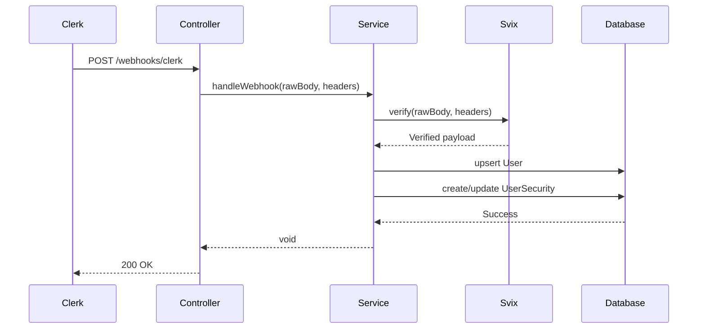

# Clerk Webhook Integration - Implementation Walkthrough

## Summary

Successfully implemented Clerk webhook integration to synchronize users between Clerk authentication service and the local NestJS/Prisma database. The implementation includes Svix signature verification, user upsert logic for account linking, and support for a hybrid authentication model.

---

## What Was Implemented

### 1. Webhook Module Structure

Created three core files in `src/webhooks/clerk/`:

#### [clerk.module.ts](file:///d:/github/ai-blog-platform/back-end/src/webhooks/clerk/clerk.module.ts)
- Configured module with `PrismaModule` import
- Registered controller and service
- Added comprehensive bilingual documentation (English + Gujarati)

#### [clerk.controller.ts](file:///d:/github/ai-blog-platform/back-end/src/webhooks/clerk/clerk.controller.ts)
- Created POST endpoint at `/webhooks/clerk`
- Added `@Public()` decorator to bypass JWT authentication
- Implemented `RawBodyRequest<express.Request>` handling for signature verification
- Extracted Svix headers (`svix-id`, `svix-timestamp`, `svix-signature`)

#### [clerk.service.ts](file:///d:/github/ai-blog-platform/back-end/src/webhooks/clerk/clerk.service.ts)
- Implemented Svix signature verification using `CLERK_WEBHOOK_SECRET`
- Handled `user.created` and `user.updated` events
- Implemented user upsert logic with account linking
- Created `UserSecurity` records for Clerk users

---

## Key Features

### ✅ Svix Signature Verification

```typescript
const wh = new Webhook(webhookSecret);
const payload = wh.verify(rawBody, {
  'svix-id': svixId,
  'svix-timestamp': svixTimestamp,
  'svix-signature': svixSignature,
});
```

**Why it matters:**
- Ensures webhook requests actually come from Clerk
- Protects against man-in-the-middle attacks
- Prevents malicious requests from unauthorized sources

### ✅ Account Linking with Upsert

```typescript
await tx.user.upsert({
  where: { email: primaryEmail },
  update: { clerkId: userData.id, ... },
  create: { clerkId: userData.id, ... },
});
```

**Scenarios handled:**
1. **New Clerk user** → Creates new User + UserSecurity records
2. **Existing manual signup** → Links `clerkId` to existing user (account linking)
3. **User update** → Updates profile information

### ✅ Hybrid Auth Model Support

The implementation supports both authentication methods:

| Auth Method | Password | emailVerified | clerkId |
|------------|----------|---------------|---------|
| **Clerk (OAuth/Social)** | Empty string | `true` | Set |
| **Manual Signup** | Hashed password | Initially `false` | `null` |
| **Linked Account** | Hashed password | `true` | Set |

### ✅ Transaction Safety

```typescript
await this.prisma.$transaction(async (tx) => {
  const user = await tx.user.upsert(...);
  await tx.userSecurity.create(...);
});
```

Both `User` and `UserSecurity` are created/updated atomically. If one fails, both rollback.

---

## Code Documentation

### Bilingual Comments

All code includes detailed line-by-line comments in both **English** and **Gujarati**:

```typescript
/**
 * શા માટે signature verify કરવું જરૂરી છે? (Why is signature verification necessary?)
 * 
 * Security Reasons:
 * 1. Ensure કરવા કે request ખરેખર Clerk માંથી આવી છે
 * 2. Man-in-the-middle attacks થી protect કરવા
 * 3. Malicious requests ને block કરવા
 */
```

### Documentation Coverage

- **Why** each decision was made
- **How** the mapping between Clerk data and Prisma schema works
- **Why** upsert is used for account linking
- **How** signature verification protects the system
- **Why** transactions ensure data consistency

---

## Changes Made

### Files Created

1. [clerk.module.ts](file:///d:/github/ai-blog-platform/back-end/src/webhooks/clerk/clerk.module.ts) - Module configuration
2. [clerk.controller.ts](file:///d:/github/ai-blog-platform/back-end/src/webhooks/clerk/clerk.controller.ts) - Webhook endpoint
3. [clerk.service.ts](file:///d:/github/ai-blog-platform/back-end/src/webhooks/clerk/clerk.service.ts) - Business logic

### Files Modified

1. [app.module.ts](file:///d:/github/ai-blog-platform/back-end/src/app.module.ts)
   - Added `ClerkWebhookModule` import and registration

### Dependencies Added

```bash
npm install svix
```

### Environment Variables Required

```env
CLERK_WEBHOOK_SECRET=whsec_your_secret_here
```

---

## Testing Setup

Created comprehensive testing guide: [CLERK_WEBHOOK_SETUP.md](file:///C:/Users/Krish/.gemini/antigravity/brain/8878ea2e-22da-4535-bcc0-e772b8b62034/CLERK_WEBHOOK_SETUP.md)

### Localtunnel Setup

```bash
# Install localtunnel
npm install -g localtunnel

# Start NestJS server
npm run start:dev

# Create tunnel
lt --port 3000 --subdomain your-unique-name
```

### Webhook Configuration

**Endpoint URL:** `https://your-subdomain.loca.lt/webhooks/clerk`

**Events to subscribe:**
- ✅ `user.created`
- ✅ `user.updated`

---

## Event Handling Flow

### user.created Event



### Data Mapping

| Clerk Field | Database Field | Notes |
|------------|----------------|-------|
| `id` | `clerkId` | Unique Clerk user ID |
| `email_addresses[0]` | `email` | Primary email |
| `first_name + last_name` | `name` | Full name |
| `username` | `username` | Falls back to email prefix |
| `image_url` | `avatar` | Profile picture |
| N/A | `emailVerified` | Set to `true` for Clerk users |
| N/A | `password` | Empty string for Clerk users |

---

## Verification Steps

### ✅ Code Compilation

- All TypeScript lint errors resolved
- Prisma client regenerated with `npx prisma generate`
- Import paths fixed to use namespace imports

### ✅ Module Registration

- `ClerkWebhookModule` imported in `app.module.ts`
- Controller registered with `@Public()` decorator
- Service injected with `PrismaService`

### ✅ Documentation Quality

- Line-by-line bilingual comments
- Comprehensive setup guide created
- Architecture diagrams included
- Testing scenarios documented

---

## Next Steps for Testing

1. **Add webhook secret to `.env`:**
   ```env
   CLERK_WEBHOOK_SECRET=whsec_...
   ```

2. **Start localtunnel:**
   ```bash
   lt --port 3000 --subdomain krish-blog-webhooks
   ```

3. **Configure in Clerk Dashboard:**
   - Add endpoint: `https://krish-blog-webhooks.loca.lt/webhooks/clerk`
   - Subscribe to `user.created` and `user.updated`
   - Copy signing secret to `.env`

4. **Test scenarios:**
   - Create new Clerk user → Verify DB sync
   - Update Clerk user → Verify DB update
   - Create Clerk user with existing email → Verify account linking

---

## Architecture Highlights

### Security
- ✅ Svix signature verification prevents unauthorized requests
- ✅ `@Public()` decorator bypasses JWT for webhook endpoint only
- ✅ Environment variable for webhook secret

### Data Integrity
- ✅ Database transactions ensure atomic operations
- ✅ Upsert prevents duplicate users
- ✅ Account linking preserves existing user data

### Maintainability
- ✅ Comprehensive bilingual documentation
- ✅ Clear separation of concerns (Controller → Service → Database)
- ✅ Detailed error logging
- ✅ Type-safe interfaces for Clerk data

---

## Files Reference

### Implementation Files
- [clerk.module.ts](file:///d:/github/ai-blog-platform/back-end/src/webhooks/clerk/clerk.module.ts)
- [clerk.controller.ts](file:///d:/github/ai-blog-platform/back-end/src/webhooks/clerk/clerk.controller.ts)
- [clerk.service.ts](file:///d:/github/ai-blog-platform/back-end/src/webhooks/clerk/clerk.service.ts)

### Configuration Files
- [app.module.ts](file:///d:/github/ai-blog-platform/back-end/src/app.module.ts)
- [schema.prisma](file:///d:/github/ai-blog-platform/back-end/prisma/schema.prisma)

### Documentation
- [CLERK_WEBHOOK_SETUP.md](file:///C:/Users/Krish/.gemini/antigravity/brain/8878ea2e-22da-4535-bcc0-e772b8b62034/CLERK_WEBHOOK_SETUP.md)
- [task.md](file:///C:/Users/Krish/.gemini/antigravity/brain/8878ea2e-22da-4535-bcc0-e772b8b62034/task.md)
